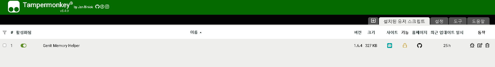
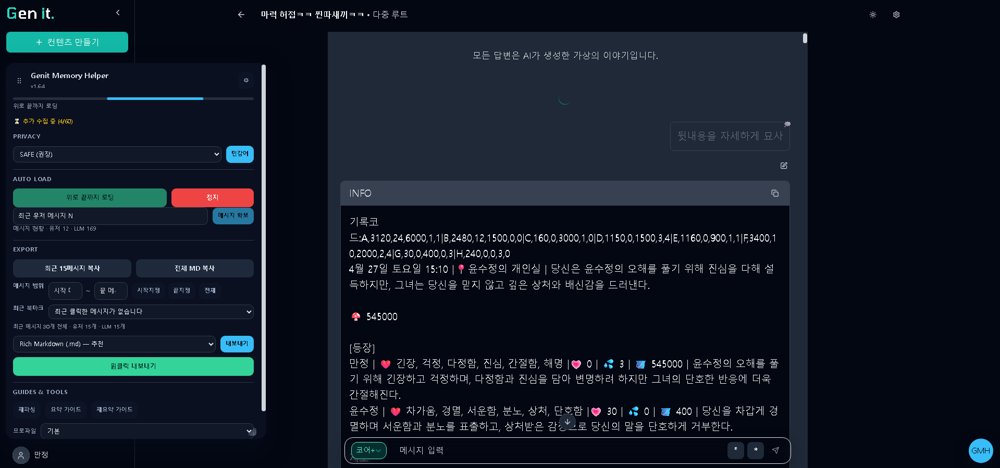

# Genit Memory Helper (Tampermonkey)
<!-- ALL-CONTRIBUTORS-BADGE:START - Do not remove or modify this section -->
[](#contributors-)
<!-- ALL-CONTRIBUTORS-BADGE:END -->

Genit 대화 로그를 **구조 보존 JSON/Markdown**으로 추출하고, LLM 요약 프롬프트를 원클릭 복사해 유저노트(2000자)에 넣을 수 있게 하는 사용자 스크립트입니다. 필요하면 고급 옵션에서 기존 Classic(JSON/TXT/MD) 포맷으로 전환할 수 있습니다.

## 📥 설치 방법

이 스크립트는 [Tampermonkey](https://www.tampermonkey.net/) 확장 프로그램을 통해 사용할 수 있습니다.

1. 먼저 Tampermonkey를 설치하세요. (Chrome/Edge/Firefox 지원)

2. 아래 버튼을 클릭해 스크립트를 설치하세요:

👉 [**최신 버전 다운로드**](https://github.com/devforai-creator/genit-memory-helper/raw/main/genit-memory-helper.user.js)
3. 브라우저가 `.user.js` 파일을 다운로드하면, Tampermonkey가 자동으로 설치 화면을 띄워줍니다.  
   "Install" 버튼을 눌러주면 완료됩니다 ✅


---

### 🔄 업데이트

- 새 버전이 나오면 위의 Raw 페이지에 올라갑니다.
- 기존 유저는 Tampermonkey가 자동으로 업데이트를 체크합니다.
- 최신 UI/UX 개편은 기본값입니다. 문제가 생기면 아래 “새 UI 킬스위치”를 참고해 임시로 기존 패널로 되돌릴 수 있습니다.
- **변경 사항 전체는** [`CHANGELOG.md`](./CHANGELOG.md)에서 버전별로 확인하세요.

## 사용법

- **위로 끝까지 로딩**: 버튼 한 번으로 대화 상단까지 자동 스크롤합니다.
- **최근 유저 메시지 N 확보**: 입력한 유저 메시지 수가 확보될 때까지 자동으로 추가 로그를 불러옵니다.
- **재시도·안정 모드·스냅샷**: 패널 하단 버튼으로 즉시 재시도하거나 안정 프로파일로 재시도, DOM 스냅샷(JSON) 저장이 가능합니다.
- **최근 15메시지 복사**: 새 대화 흐름만 빠르게 정리해 AI에 붙여넣거나 검수할 때 활용하세요. (15메시지 기준이며 화면에 로드된 순서를 따릅니다.)
- **전체 Markdown 복사**: 세션 전체를 한 번에 복사해 유저노트나 개인 기록용으로 붙여넣습니다.
- **Rich 구조 보존 Export (기본, Markdown 권장)**: Markdown/JSON/TXT 포맷으로 메시지·파트 구조(코드/인용/이미지 포함)를 그대로 내보냅니다. 고급 옵션(클래식 그룹)에서는 기존 경량 포맷(JSON/TXT/MD)도 선택할 수 있으며, 구조 보존 내보내기가 실패하면 자동으로 Classic 포맷으로 폴백됩니다.
- **메시지 범위 내보내기**: Export 섹션의 `메시지 범위` 입력에 시작/끝 **메시지 번호**(가장 최근이 1, 그 이전이 2 … 순서)를 적어 원하는 구간만 파일로 저장할 수 있습니다. `시작지정`/`끝지정` 버튼을 누르면 최근 클릭한 메시지가 북마크 큐(최대 5개)에 저장되고, 드롭다운에서 과거 책갈피를 다시 선택할 수 있습니다. 범위/북마크 축은 메시지 번호 하나로 단일화되어 있으며, 예전 플레이어 축 북마크도 불러오는 즉시 메시지 기준으로 보정됩니다. 대화 최상단/최하단 메시지를 포함하거나 막 스크롤한 직후에는 범위가 엇갈릴 수 있으니 이상하다 싶으면 `전체` 버튼으로 초기화해 주세요.
- **요약/재요약 가이드**: LLM용 프롬프트를 클립보드로 복사합니다(문구가 “JSON” 대신 “로그 파일” 기준으로 정리됨).
- **재파싱**: 오류가 날 경우 로그를 다시 읽어 상태를 확인합니다.

### 🎛️ 패널 제어 & 단축키

- 좌측 상단 그립(⋮⋮)을 드래그하면 패널을 좌·우 하단으로 도킹할 수 있으며 위치는 브라우저별로 기억됩니다.
- 우측 하단 손잡이로 패널 크기를 조절할 수 있습니다. 모바일에서는 자동으로 92vw/76vh 범위 안에 맞춰집니다.
- 단축키: `Alt+M` (패널 토글), `Alt+G` (패널 포커스), `Esc` (닫기), `Alt+P` (민감어 설정).
- ⚙ 버튼 → **GMH 설정**에서 자동 접힘 시간, 집중 모드, 드래그/리사이즈 허용 여부를 즉시 변경할 수 있습니다.
- 자동 접힘을 끄거나 집중 모드를 켜두면 패널이 화면을 가리지 않고 필요할 때만 등장합니다.

### 권장 UX 플로우

1. 대화 진행 → 적당히 길어지면
2. 위로 스크롤 후 **파일 내보내기**에서 기본 Rich Markdown 내보내기(필요 시 Rich TXT/JSON 또는 Classic(JSON/TXT/MD) 전환)
3. ChatGPT/Gemini 등에 파일 업로드 + **요약 가이드** 붙여넣기
4. 결과를 Genit **유저노트(≤2000자)** 에 붙여넣기
5. 이후는 **재요약 가이드**와 새 로그 파일로 누적 업데이트

## 요약 범위 선택 (중요 UX)

Genit Memory Helper는 **현재 화면에 로드된 대화만** JSON으로 내보냅니다.  
따라서 사용자가 원하는 구간까지 로그를 불러와야 그 부분이 요약에 포함됩니다.

- Export 패널의 `메시지 범위` 입력을 사용하면 현재 확보된 메시지 중 원하는 시작/끝 지점을 선택해 부분만 내보낼 수 있습니다. 번호는 “가장 최근 = 1”부터 올라가므로, 오래된 메시지를 지정하려면 더 큰 숫자를 입력하면 됩니다. 선택을 비우면 전체 대화가 포함되며, `시작지정`/`끝지정` 버튼으로 미리보기에서 보고 있는 메시지를 바로 지정할 수 있습니다. 

### 빠르게 스크롤하기

- 패널의 **위로 끝까지 로딩** 버튼을 누르면 더 이상 로드할 항목이 없을 때까지 자동으로 스크롤합니다.
- 특정 시점까지만 확보하고 싶다면 **최근 유저 메시지 N 확보** 입력란에 원하는 메시지 수를 넣고 실행하면 됩니다. (유저가 발화할 때마다 카운트가 증가합니다.)
- 문제가 생기면 아래 **재시도/안정 모드/DOM 스냅샷** 버튼으로 바로 복구하거나 상황을 기록해 둘 수 있습니다.

👉 즉, 스크롤을 어디까지 올리느냐가 곧 “요약 범위 선택”이 됩니다.  
이 단순한 제스처 덕분에 사용자는 "어디까지 기억을 정리할지"를 직접 컨트롤할 수 있습니다.

### 🧪 새 UI 킬스위치 & 초기화

차세대 모달/상태 패널은 기본적으로 활성화되어 있습니다. 드물게 문제가 생길 경우 아래 명령으로 즉시 롤백하거나 플래그를 초기화할 수 있습니다.

```js
// 콘솔에서 실행 (브라우저 F12)
localStorage.setItem("gmh_kill", "1"); // 긴급 킬스위치 (GMH 전체 비활성화)
localStorage.removeItem("gmh_kill"); // 킬스위치 해제 (기능 복구)
```

- 킬스위치(`gmh_kill`)가 켜져 있으면 GMH 스크립트가 완전히 비활성화됩니다. 급한 롤백이 필요할 때만 사용한 뒤, 문제가 해결되면 꼭 해제하세요.
- 킬스위치를 비활성화하고 페이지를 새로고침하면 현대 디자인 패널이 자동으로 복구됩니다.
- ⚙ 버튼의 **GMH 설정**에서 자동 접힘 시간, 집중 모드, 드래그/리사이즈 옵션을 조정할 수 있습니다.

## 개발 & 테스트

- `npm install`
- `USE_ROLLUP=1 npm run build`
- `npm run build`
- `npm test` (Vitest 기반 단위 테스트 – dist 산출물을 검사합니다)
- `npm run test:smoke`
  - `GENIT_TEST_URL` + `GENIT_USER`/`GENIT_PASS`를 설정하면 테스트 계정으로 로그인해 실제 세션 페이지에서 패널과 자동 스크롤을 검증합니다.
  - 공개 데모 URL이 있다면 `GENIT_DEMO_URL`을 지정해 로그인 없이 패널 렌더만 확인할 수 있습니다.
- 로그인 페이지가 기본 셀렉터와 다르다면 아래 환경변수로 조정하세요.
  - `GENIT_LOGIN_URL`, `GENIT_LOGIN_EMAIL_SELECTOR`, `GENIT_LOGIN_PASSWORD_SELECTOR`, `GENIT_LOGIN_SUBMIT_SELECTOR`, `GENIT_LOGIN_SUCCESS_SELECTOR`
- 루트 디렉터리의 `.env.example`을 복사해 `.env`를 만들면 위 환경변수를 빠르게 채울 수 있습니다.
- 버전 릴리스: `npm run bump:patch` / `npm run bump:minor` / `npm run bump:major` → 버전 상승, 메타데이터 동기화, dist 빌드, 태그 푸시가 자동으로 처리됩니다. (로컬 변경이 있다면 먼저 커밋/스태시하세요.)

### 릴리스 스크립트 메모

1. 모든 변경을 커밋하거나 정리한 뒤 `npm test`로 기본 단위 테스트를 확인합니다.
2. 릴리스할 버전에 맞춰 `npm run bump:patch` (또는 `bump:minor`/`bump:major`)를 실행하면 버전이 올라가고 원격으로 태그까지 푸시됩니다.
3. GitHub Actions 릴리스 워크플로가 태그를 감지해 dist 산출물을 업로드하니 추가 수동 작업은 필요 없습니다.

### GitHub Actions 비밀 설정

CI에서 스모크 테스트와 자동 릴리스를 활용하려면 프로젝트의 **Settings → Secrets → Actions**에 다음 키를 추가하세요.

| Secret                      | 설명                                                      |
| --------------------------- | --------------------------------------------------------- |
| `GENIT_TEST_URL`            | 로그인 후 접근 가능한 테스트용 대화 세션 URL              |
| `GENIT_DEMO_URL` (옵션)     | 로그인 불필요한 공개 데모 URL                             |
| `GENIT_USER` / `GENIT_PASS` | 테스트 계정 자격 증명                                     |
| 그 외 (옵션)                | 로그인 커스터마이징을 위한 `GENIT_LOGIN_*` 시리즈         |
| `GENIT_HOME_URL` (옵션)     | 자산 해시 핑거프린트 대상 홈 URL(기본: https://genit.ai/) |

GitHub Actions 워크플로는 비밀이 없는 경우 해당 단계(로그인/스모크)를 자동으로 건너뜁니다.

## 🔒 프라이버시 가드

- 패널 상단에서 **SAFE/STANDARD/RESEARCH** 프로필을 선택할 수 있습니다.
  - **SAFE**: 이메일·전화·주민번호·카드·IP에 더해 주소 힌트까지 가리고, 폭력/자해 등 민감 단어도 완곡화합니다.
  - **STANDARD**: 핵심 PII(이메일·전화·주민번호·카드·IP·@handle)만 가립니다. 주소나 서술은 그대로 둬야 할 때 선택하세요.
  - **RESEARCH**: 고정으로 가리는 PII만 유지하고 나머지는 최대한 원문을 살립니다. 연구/후처리 목적용이라 공유 전에 반드시 재검토가 필요합니다.
- 복사/내보내기 전에 항상 **레다크션 요약 + 공유 책임 확인창**이 뜹니다. 취소하면 작업이 중단됩니다.
- 민감한 블랙리스트/화이트리스트를 직접 등록해 특정 키워드를 항상 가리거나(블랙) 보호(화이트)할 수 있습니다.
- 미성년자 성적 맥락이 감지되면 내보내기/복사가 차단됩니다.
- 파일을 저장하면 동시에 `*.manifest.json`이 내려와 "어떤 프로필로, 무엇을 얼마나 가렸는지"를 남겨 재현성을 확보합니다.

> ⚠️ 자동 레다크션이 있더라도 업로드 전에 반드시 내용을 검토하세요.  
> 레다크션 요약(EMAIL:2, PHONE:1 등)을 보고 민감 정보가 남아 있지 않은지 확인한 뒤 외부 LLM에 공유하는 것을 권장합니다.

## FAQ

- **서버로 전송되나요?** 아니요. 모든 처리는 로컬에서만 이뤄집니다.
- **성능에 영향 있나요?** DOM 파싱만 수행, 서버 요청 증가 없음.
- **고장 시?** DOM 클래스/텍스트가 바뀌면 패널의 **재파싱** 버튼으로 확인 후, GitHub 이슈에 보고해주세요.

### Q. 민감한 내용이 포함되면 어떻게 하나요?

A. 스크립트는 자동으로 대화 로그를 요약하지만, 민감한 부분까지 전부 안전하게 처리해 주는 건 아닙니다.  
👉 따라서 중요한 내용은 직접 입력하거나, 요약 결과를 확인하면서 스스로 수정해 주시는 게 가장 안전합니다.

### Q. JSON 용량이 너무 크면 요약이 안 되는데요?

A. 네, 모델에는 **토큰(token)**이라는 입력 한계가 있습니다.

- 5만~10만 토큰 정도까지는 대체로 괜찮지만, 50만 이상이 되면 모델이 한 번에 처리하지 못해 요약이 빈칸으로 나올 수 있습니다.
- 해결 방법:
  1. **장면(scene) 단위**로 로그를 쪼개서 요약하기
  2. **필요한 부분만 발췌**해서 요약하기
  3. 나눠서 요약한 뒤 → 최종적으로 다시 합쳐서 정리하기

👉 즉, 토큰이 너무 많으면 “나눠서 처리”하는 것이 가장 확실한 방법입니다.

## 개발자 참고 (Developer Notes)

- 소스 코드는 `src/` 아래 모듈로 분리되어 있으며, `src/index.js`가 Tampermonkey 환경에 `GMH` 네임스페이스를 노출합니다. 기존 단일 스크립트와의 호환을 위해 `src/legacy.js`가 단계적으로 모듈을 조립합니다.
- Privacy/Export 로직은 각각 `src/privacy/`, `src/export/`에 있으며, UI 조립 코드는 `src/ui/`에 위치합니다. 자동 로더, 공유, 요약 가이드 등 독립 기능은 `src/features/`에 배치되어 있습니다.
- 요약/재요약 프롬프트는 `src/features/guides.js`에서 정의되고, 패널 버튼 바인딩은 `src/ui/guide-controls.ts`가 담당합니다. 테스트나 맞춤 프롬프트 주입 시 이 모듈을 사용하세요.
- 프라이버시 프로필 드롭다운·복사/내보내기·원클릭 공유에 대한 패널 이벤트 바인딩은 `src/ui/panel-interactions.ts`에서 관리합니다. 새로운 패널 요소를 추가할 때는 이 모듈을 통해 의존성을 주입하세요.
- Privacy Gate(모달/legacy 오버레이 포함)는 `src/ui/privacy-gate.ts`가 생성합니다. Modern/Legacy UI 모두 여기서 의존성을 주입하므로 Tampermonkey 전역 대신 `ENV`/모듈 API를 연결하세요.
- `npm run build`는 기존 userscript를 그대로 복사하며, `USE_ROLLUP=1 npm run build`를 사용하면 Rollup 번들을 생성해 Tampermonkey에 주입할 수 있습니다. 새 모듈 작업 시에는 Rollup 경로로도 반드시 점검하세요.
- `npm run typecheck`는 JSDoc이 적용된 핵심 모듈(자동 로더, 공유 워크플로, 프라이버시 파이프라인, 모달)을 대상으로 TypeScript `checkJs` 검사를 실행합니다. 범위를 넓힐 때는 `tsconfig.json`의 `include`를 조정하고 필요한 typedef를 추가하세요.
- Tampermonkey/GM 전역과 공유 타입은 `types/` 아래 ambient 선언으로 관리합니다. 새로운 외부 의존성을 추가할 때는 동일 폴더에 선언을 추가하고 `npm run typecheck`로 검증하세요.

## 유지보수 정책

이 스크립트는 개인 프로젝트로 제작되었으며, **유지보수는 보장되지 않습니다**.  
이슈 및 PR은 환영하지만, 학업 일정 등으로 인해 응답이 늦거나 반영되지 않을 수 있습니다.  
치명적인 버그(예: 전혀 작동하지 않는 경우)에 한해서만 가볍게 대응할 수 있습니다.  
필요하다면 자유롭게 포크해서 수정·사용해 주세요.

## 라이선스

이 프로젝트는 GPL-3.0-or-later 라이선스를 따릅니다.

---

## 🏆 기여자 성장 사다리 (Our Contributor Ladder)

`gmh` 프로젝트는 여러분의 기여와 함께 성장하며, 기여자 여러분의 성장 또한 응원합니다. 저희는 기여의 종류와 깊이에 따라 다음과 같은 역할을 부여하여 여러분의 노력을 기억하고 인정합니다.

| 역할 (Role) | 달성 조건 (How to Achieve) | 책임과 권한 (Responsibilities & Privileges) |
| :--- | :--- | :--- |
| **🥇 Tier 1: 탐험가 (Explorer)** | 첫 번째 PR이 성공적으로 병합(Merge)된 분 | 프로젝트의 공식 기여자가 되신 것을 축하합니다! 이제 당신은 `gmh` 생태계의 소중한 일원입니다. |
| **🥈 Tier 2: 건축가 (Builder)** | `AI-Friendly` 라벨이 붙은 코드 관련 PR을 처음으로 성공시킨 분 | AI를 활용해 실제 기능을 만들어내는 핵심적인 빌더입니다. 더 복잡한 이슈에 도전할 자격이 주어집니다. |
| **🥉 Tier 3: 수호자 (Guardian)** | 3회 이상 의미있는 기여를 하고, 다른 사람의 질문에 친절하게 답변하는 등 커뮤니티에 긍정적인 영향을 주신 분 | 새로운 탐험가들의 질문에 답변하고, 간단한 PR을 리뷰하며 프로젝트를 함께 지켜나가는 멘토 역할을 수행합니다. |

여러분의 첫 번째 기여를 시작으로, 수호자가 되어 새로운 기여자들을 이끌어주는 멋진 리더로 성장해보세요!

## Contributors ✨

Thanks goes to these wonderful people ([emoji key](https://allcontributors.org/docs/en/emoji-key)):

<!-- ALL-CONTRIBUTORS-LIST:START - Do not remove or modify this section -->
<!-- prettier-ignore-start -->
<!-- markdownlint-disable -->
<table>
  <tbody>
    <tr>
      <td align="center" valign="top" width="14.28%"><a href="https://github.com/devforai-creator"><br /><sub><b>SY Dev</b></sub></a><br /><a href="#ideas-devforai-creator" title="Ideas, Planning, & Feedback">🤔</a> <a href="https://github.com/devforai-creator/genit-memory-helper/commits?author=devforai-creator" title="Code">💻</a> <a href="https://github.com/devforai-creator/genit-memory-helper/commits?author=devforai-creator" title="Documentation">📖</a></td>
      <td align="center" valign="top" width="14.28%"><a href="https://github.com/tpalsdhkdwk1"><br /><sub><b>tpalsdhkdwk1</b></sub></a><br /><a href="https://github.com/devforai-creator/genit-memory-helper/issues?q=author%3Atpalsdhkdwk1" title="Bug reports">🐛</a> <a href="#ideas-tpalsdhkdwk1" title="Ideas, Planning, & Feedback">🤔</a></td>
    </tr>
  </tbody>
</table>

<!-- markdownlint-restore -->
<!-- prettier-ignore-end -->

<!-- ALL-CONTRIBUTORS-LIST:END -->

This project follows the [all-contributors](https://github.com/all-contributors/all-contributors) specification. Contributions of any kind welcome!
